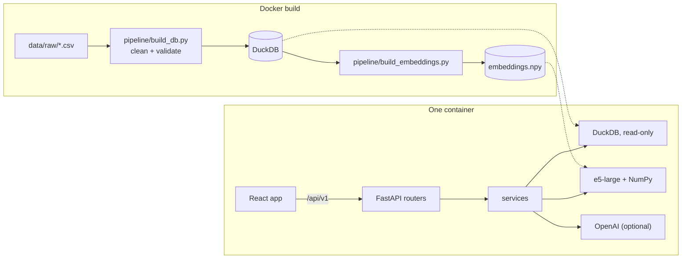

# Movie Intelligence Explorer

A web app for studio decision makers to explore how movies perform on streaming in LATAM: semantic
search over the catalog, a movie view with availability and consumption, a performance dashboard,
Discover shelves, and a Decision Studio for licensing and project decisions, including a chat that
answers from the data and says so when the data cannot answer.

- **Live app:** added after the Dokploy deploy.
- **Deploy:** one `Dockerfile` builds the data, the embeddings and the app, and serves everything on
  port 4040. Steps in [08-deployment](docs/08-deployment.md#dokploy).
- **API docs:** `/api/docs` on the running app (serves the hand-written OpenAPI contract).
- Built by [Nicole Perrone](https://www.linkedin.com/in/perronenicole/).

## Run it locally

Requirements: Python 3.12 with [uv](https://docs.astral.sh/uv/), Node 22, make.

```bash
make setup   # install backend and frontend dependencies, build the database and embeddings
make dev     # API on http://localhost:5001, app on http://localhost:5173
```

The first `make setup` downloads the embedding model (about 2.2 GB). Ports can be changed with
`API_PORT` and `WEB_PORT`; 5000 is avoided because macOS uses it for AirPlay.

LLM features are optional. To enable them, copy `.env.example` to `.env` and set `OPENAI_API_KEY`
(and `OPENAI_MODEL` if you want a model other than the default). Without a key every page works and
the LLM parts say they are unavailable.

With Docker instead: `docker compose up --build`, then open http://localhost:4040. The image serves
the app and the API on one port (4040), which is also what Dokploy exposes.

Other commands: `make test` (lint, type checks and all tests), `make eval` (search evaluation),
`make codegen` (regenerate types from the API spec), `make themes` (rebuild the AI themes; needs an
OpenAI key and a human review of the names).

## How it was built: spec first

Every behavior was written down before the code, and the git history shows each spec committed before
the code that implements it.

| Spec | Covers |
|---|---|
| [00-conventions](docs/00-conventions.md) | Code and writing rules, commits |
| [01-product](docs/01-product.md) | Users, the five surfaces, user stories |
| [02-architecture](docs/02-architecture.md) | Diagrams and decision log |
| [03-data](docs/03-data.md) | Tables, grains, validations, integration rules |
| [04-metrics](docs/04-metrics.md) | Every metric, with its formula |
| [05-search](docs/05-search.md) | Embeddings, filters, themes, evaluation |
| [06-llm](docs/06-llm.md) | Every LLM use, its prompt, validation and fallback |
| [07-frontend](docs/07-frontend.md) | Pages, states, visual design |
| [08-deployment](docs/08-deployment.md) | Image, configuration, Dokploy, CI |
| [api/openapi.yaml](docs/api/openapi.yaml) | The API contract (v1, path-versioned) |

The OpenAPI file is the source of truth: `make codegen` generates the backend Pydantic models and the
frontend TypeScript types from it, CI fails if they drift, and a contract test (schemathesis) checks
every GET endpoint's responses against it.

## Architecture



- **Backend:** FastAPI, DuckDB (embedded, read-only, file access disabled), sentence-transformers,
  NumPy. Routers only handle HTTP; services hold all SQL and logic.
- **Frontend:** React, TypeScript, Vite, Tailwind, shadcn/ui, TanStack Query, Recharts. All shareable
  state (filters, tabs, search) lives in the URL.
- **Deployment:** one Docker image built from the raw CSVs, deployed on Dokploy. See
  [08-deployment](docs/08-deployment.md).

Main decisions and the alternatives rejected are in the
[decision log](docs/02-architecture.md#decisions).

## Data integration

The three datasets have different grains, and joining them carelessly multiplies metrics.

| Table | Grain |
|---|---|
| `movies` (A) | one row per movie |
| `availability` (B) | movie × country × platform × platform type, one snapshot (Jun 2026) |
| `consumption` (C) | movie × month × country × platform, Jan 2023 to Jun 2026 |

- Availability and consumption are never joined row by row. A movie available on five platforms in
  Brazil would otherwise count its Brazilian streams five times. Movie-level filters are applied as
  `title_id IN (...)`.
- The build fails if a grain has duplicates, an id is unknown, or a metric is negative or fractional.
- Consumption series are gap-filled with zeros (857 movies have missing months).
- B and C use different platform names (`Amazon` vs `Amazon Prime Video`); each feature uses its own
  dataset's names, with one explicit mapping for the licensing check.
- Ratios such as engagement are ratios of sums, never averages of ratios.
- Tests compare dashboard totals for ten filter combinations with pandas sums over the raw CSVs.

## Semantic search

- **Model:** `intfloat/multilingual-e5-large`, run locally, so search works without any external API
  and understands Spanish and Portuguese queries.
- **What is embedded:** genres and plot, with the `passage:` prefix. Titles, directors and cast are
  left out: their words matched query words without matching meaning (a query with "dark" returned
  *Orion and the Dark*).
- **Retrieval:** exact cosine similarity with NumPy over 1,590 vectors (under a millisecond; a
  vector database is not needed at this size), combined with structured filters in SQL.
- **Relevance cutoff:** e5 scores sit in a narrow band for any text, so an absolute threshold cannot
  separate matches from noise. A result is kept when it stands out from the rest of the catalog for
  that query (z-score ≥ 2.5). With filters, every candidate is kept and ranked.
- **Suggestions:** the search box shows title matches and meaning matches as you type (embeddings
  only). Enter runs the full search, where an LLM also proposes filters (years, countries, platforms,
  people). The proposed filters appear as chips you can remove.

The model and the embedded text were chosen with an evaluation set of 15 queries (4 from the brief,
Spanish and Portuguese included) and explicit relevance rules (`backend/eval/queries.yaml`).

| Model | Embedded text | Mean precision@5 |
|---|---|---|
| multilingual-e5-small | title + genres + director + plot | 0.57 |
| multilingual-e5-small | genres + plot | 0.71 |
| multilingual-e5-base | genres + plot | 0.68 |
| multilingual-e5-large | title + genres + director + plot | 0.67 |
| **multilingual-e5-large** | **genres + plot** | **0.75** |

Current results with the chosen setup (`make eval`):

| Query | P@5 |
|---|---|
| dark psychological thrillers about obsession | 0.60 |
| family movies about overcoming loss | 0.20 |
| animated adventures | 1.00 |
| movies about artificial intelligence | 0.80 |
| películas de terror sobre casas embrujadas | 0.40 |
| documentales sobre música | 1.00 |
| space exploration and astronauts | 1.00 |
| sports underdog stories | 1.00 |
| Mean over 15 queries | 0.75 |

"Family movies about overcoming loss" stays low with every model: the catalog's family movies rarely
describe grief in their plots, and the relevance rule only counts explicit plot mentions.

## Where the LLM is used, and where it is not

The LLM never computes numbers and never makes a decision.

| Use | What it does | Guard |
|---|---|---|
| Search interpretation | Turns a query into filters and a cleaner search text | Values are checked against the real vocabularies; unknown values are dropped |
| Movie insight, dashboard "What changed" | Writes 2 or 3 sentences from facts computed in SQL | Every number in the text must appear in the facts, or the text is not shown |
| Licensing and concept memos | Writes the memo around a demand signal computed in code | Same number guard; fixed caveats added by the API |
| Ask the data (chat) | Answers questions using only read-only SQL and semantic search | One SELECT per call on a locked read-only connection; every answer shows its SQL and rows; answers with numbers not found in the results are withheld; "no data" and "outside the dataset" are explicit answers |
| Themes (offline) | Names clusters of similar movies for Discover | Reviewed by a person before commit |

Without an API key the whole app works: search falls back to embeddings only, and each LLM section
says it is unavailable.

## The product

| Page | Decision it supports |
|---|---|
| Dashboard | How the catalog performs and what changed. Period presets, filters (including Sony titles), KPIs with the previous period, "where does this number come from" panels, comparison lines by platform, country or period |
| Discover | What stands out without a query: top by country and platform, rising, evergreen, binge-worthy, hidden gems, AI themes |
| Search | Which titles match an idea, in English or Spanish |
| Movie | What a title is, where it is available and how it performed, by country and platform |
| Decision Studio | Should we license this title to this platform in this country (comparable titles, expected range, verdict, memo); which project to revive (demand of up to 3 loglines); and a chat to ask the data |

## Tests

- Backend (93): data validations, metric correctness against the raw CSVs, search filter semantics,
  LLM guards with a fake client, chat assistant safety (DROP, INSERT, multiple statements and file
  reads are rejected), error envelopes, and a schemathesis contract test.
- Frontend (11): formatting, month math, Discover cover rules, empty states.
- CI runs lint, type checks, all tests and a codegen drift check on every push.

## Known limitations

- Consumption covers 4 countries and 4 platforms; availability is a single snapshot, so the app
  cannot say when a title was available.
- Nonsense or very generic queries still return a few weak matches without the LLM (see the relevance
  cutoff above).
- Expected ranges come from comparable titles; they are evidence, not forecasts.
- Themes come from k-means on the plot embeddings (k = 22, chosen by silhouette). The silhouette is
  close to zero: plots do not form sharply separated groups, so themes are useful groupings, not
  strict categories. The current names were written by hand from each cluster's central movies
  (`data/curated/theme_names.json`); `make themes` can regenerate them with the LLM.
- Platform logos load from Google's favicon service; a monogram is shown if they cannot load.

## Next steps

- pgvector or FAISS once the catalog grows past what fits comfortably in memory.
- A cross-encoder reranker on the top 50 results to lift precision on subtle queries.
- Docling to extract press kits and scripts (PDF) and add them to the search index.
- Availability history, so licensing can use windows and exclusivity.
- A forecasting model trained on first-months curves, validated against the comparables approach.

## AI-assisted development

Built with Claude Code (Anthropic) as a pair programmer inside a spec-driven workflow:

- Specs were drafted in conversation, then reviewed and changed before any code was written. Product
  direction, the pages, the visual design, and the rules for the LLM (no invented numbers, explicit
  "no data" answers) came from the author.
- Claude Code wrote most of the code against those specs, ran the tests and the evaluation, and
  checked the UI in a browser.
- Decisions were made from evidence gathered during the build: the embedding model and document
  format from the evaluation table above, the relevance cutoff from score distributions, and fixes
  found by the contract test (a 500 on out-of-range months, a wrong status code on 405).
