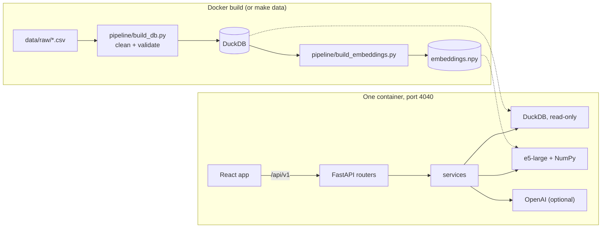

# Movie Intelligence Explorer

A web app for studio decision makers to explore how movies perform on streaming in LATAM: semantic
search over the catalog, a movie view with availability and consumption, a performance dashboard,
Discover shelves, and a Decision Studio for licensing and project decisions, including a chat that
answers from the data and says so when the data cannot answer.

- **Live app:** https://movie-intelligence.nicoleperrone.com
- **Deploy:** one `Dockerfile` builds the data, the embeddings and the app, and serves everything on
  port 4040. Steps in [08-deployment](docs/08-deployment.md#dokploy).
- **API docs:** `/api/docs` on the running app (serves the hand-written OpenAPI contract).
- Built by [Nicole Perrone](https://www.linkedin.com/in/perronenicole/).

## Run it locally

Requirements: Python 3.12 with [uv](https://docs.astral.sh/uv/), Node 22 and make.

```bash
git clone https://github.com/nickyperrone/Movie_Intelligence_Explorer.git
cd Movie_Intelligence_Explorer
make setup   # installs dependencies, builds the database and the embeddings
make dev     # API on http://localhost:5001, app on http://localhost:5173
```

- The first `make setup` downloads the embedding model (about 2.2 GB) and embeds the 1,590 plots.
  Later runs reuse both.
- Open http://localhost:5173. The Vite server sends `/api` calls to the API, so there is nothing
  else to configure.
- Ports can be changed with `API_PORT` and `WEB_PORT` (`make dev API_PORT=5002`). 5000 is avoided
  because macOS uses it for AirPlay.
- The LLM features are optional. To turn them on, copy `.env.example` to `.env` and set
  `OPENAI_API_KEY`. Without a key every page works, search uses embeddings only, and each LLM section
  says it is unavailable.

Other commands: `make test` (lint, type checks and all tests), `make eval` (search evaluation),
`make codegen` (regenerate types from the API spec), `make themes` (rebuild the AI themes; needs an
OpenAI key and a human review of the names).

## Run it with Docker

Only Docker is needed:

```bash
docker compose up --build   # or: make up
```

Then open http://localhost:4040. The same image is what Dokploy runs.

- One image holds everything: the build compiles the frontend, builds the database from
  `data/raw/`, downloads the model and computes the embeddings, so the container downloads nothing when it starts.
- The first build takes several minutes, and the image is about 5 GB, mostly PyTorch and the model.
  Give Docker at least 4 GB of memory.
- If a `.env` file exists, compose passes it to the container. Without it the app runs with the LLM
  features off.
- Without compose:

  ```bash
  docker build -t movie-intelligence .
  docker run -p 4040:4040 -e OPENAI_API_KEY=sk-... movie-intelligence
  ```

- The container runs as a non-root user and has a health check on `/api/v1/health`.

## How it was built: spec first

Every behavior was written down before the code, and the git history shows each spec committed before
the code that implements it.

| Spec | Covers |
|---|---|
| [00-conventions](docs/00-conventions.md) | Code and writing rules, commits |
| [01-product](docs/01-product.md) | Users, the five surfaces, user stories |
| [02-architecture](docs/02-architecture.md) | Diagrams and decision log |
| [03-data](docs/03-data.md) | Tables, grains, validations, integration rules |
| [04-metrics](docs/04-metrics.md) | Every metric, with its formula |
| [05-search](docs/05-search.md) | Embeddings, filters, themes, evaluation |
| [06-llm](docs/06-llm.md) | Every LLM use, its prompt, validation and fallback |
| [07-frontend](docs/07-frontend.md) | Pages, states, visual design |
| [08-deployment](docs/08-deployment.md) | Image, configuration, Dokploy, CI |
| [api/openapi.yaml](docs/api/openapi.yaml) | The API contract (v1, path-versioned) |

The OpenAPI file is the source of truth: `make codegen` generates the backend Pydantic models and the
frontend TypeScript types from it, CI fails if they drift, and a contract test (schemathesis) checks
every GET endpoint's responses against it.

## Architecture



- **Data is built ahead of time.** The pipeline reads the three CSVs, cleans them, fails on any
  broken rule (duplicate grain, unknown id, negative metric) and writes a DuckDB file and the plot
  embeddings. The running app only reads.
- **One process serves everything.** FastAPI serves the API under `/api/v1` and the built React app.
  There is no separate web server, database server or vector database to run.
- **Backend:** routers only handle HTTP; services hold all SQL and logic. DuckDB is embedded, opened
  read-only with file access disabled. The embedding model and the vectors are loaded once at
  startup; a search embeds the query and compares it with every movie in NumPy.
- **Frontend:** React, TypeScript, Vite, Tailwind, shadcn/ui, TanStack Query and Recharts. Filters,
  tabs and searches live in the URL, so every view can be shared as a link.
- **Contract:** the hand-written OpenAPI file generates the Pydantic models and the TypeScript types.
- **Deployment:** one Dockerfile on Dokploy. See [08-deployment](docs/08-deployment.md).

| Folder | Contents |
|---|---|
| `docs/` | Specs and the API contract |
| `data/raw/` | The three source CSVs |
| `data/curated/` | Reviewed files that are committed (theme names) |
| `backend/pipeline/` | Offline build: database, embeddings, themes |
| `backend/app/` | FastAPI app: `routers/` for HTTP, `services/` for SQL and logic |
| `backend/eval/` | Search evaluation queries and runner |
| `frontend/src/` | React app: `pages/`, `components/`, `api/` hooks |

Main decisions and the alternatives rejected are in the
[decision log](docs/02-architecture.md#decisions).

## Data integration

The three datasets have different grains, and joining them carelessly multiplies metrics.

| Table | Grain |
|---|---|
| `movies` (A) | one row per movie |
| `availability` (B) | movie × country × platform × platform type, one snapshot (Jun 2026) |
| `consumption` (C) | movie × month × country × platform, Jan 2023 to Jun 2026 |

- Availability and consumption are never joined row by row. A movie available on five platforms in
  Brazil would otherwise count its Brazilian streams five times. Movie-level filters are applied as
  `title_id IN (...)`.
- The build fails if a grain has duplicates, an id is unknown, or a metric is negative or fractional.
- Consumption series are gap-filled with zeros (857 movies have missing months).
- B and C use different platform names (`Amazon` vs `Amazon Prime Video`); each feature uses its own
  dataset's names, with one explicit mapping for the licensing check.
- Ratios such as engagement are ratios of sums, never averages of ratios.
- Tests compare dashboard totals for ten filter combinations with pandas sums over the raw CSVs.

## Semantic search

- **Model:** `intfloat/multilingual-e5-large`, run locally, so search works without any external API
  and understands Spanish and Portuguese queries.
- **What is embedded:** genres and plot, with the `passage:` prefix. Titles, directors and cast are
  left out: their words matched query words without matching meaning (a query with "dark" returned
  *Orion and the Dark*).
- **Retrieval:** exact cosine similarity with NumPy over 1,590 vectors (under a millisecond; a
  vector database is not needed at this size), combined with structured filters in SQL.
- **Relevance cutoff:** e5 scores sit in a narrow band for any text, so an absolute threshold cannot
  separate matches from noise. A result is kept when it stands out from the rest of the catalog for
  that query (z-score ≥ 2.5). With filters, every candidate is kept and ranked.
- **Suggestions:** the search box shows title matches and meaning matches as you type (embeddings
  only). Enter runs the full search, where an LLM also proposes filters (years, countries, platforms,
  people). The proposed filters appear as chips you can remove.

The model and the embedded text were chosen with an evaluation set of 15 queries (4 from the brief,
Spanish and Portuguese included) and explicit relevance rules (`backend/eval/queries.yaml`).

| Model | Embedded text | Mean precision@5 |
|---|---|---|
| multilingual-e5-small | title + genres + director + plot | 0.57 |
| multilingual-e5-small | genres + plot | 0.71 |
| multilingual-e5-base | genres + plot | 0.68 |
| multilingual-e5-large | title + genres + director + plot | 0.67 |
| **multilingual-e5-large** | **genres + plot** | **0.75** |

Current results with the chosen setup (`make eval`):

| Query | P@5 |
|---|---|
| dark psychological thrillers about obsession | 0.60 |
| family movies about overcoming loss | 0.20 |
| animated adventures | 1.00 |
| movies about artificial intelligence | 0.80 |
| películas de terror sobre casas embrujadas | 0.40 |
| documentales sobre música | 1.00 |
| space exploration and astronauts | 1.00 |
| sports underdog stories | 1.00 |
| Mean over 15 queries | 0.75 |

"Family movies about overcoming loss" stays low with every model: the catalog's family movies rarely
describe grief in their plots, and the relevance rule only counts explicit plot mentions.

## Where the LLM is used, and where it is not

The LLM never computes numbers and never makes a decision.

| Use | What it does | Guard |
|---|---|---|
| Search interpretation | Turns a query into filters and a cleaner search text | Values are checked against the real vocabularies; unknown values are dropped |
| Movie insight, dashboard "What changed" | Writes 2 or 3 sentences from facts computed in SQL | Every number in the text must appear in the facts, or the text is not shown |
| Licensing and concept memos | Writes the memo around a demand signal computed in code | Same number guard; fixed caveats added by the API |
| Ask the data (chat) | Answers questions using only read-only SQL and semantic search | One SELECT per call on a locked read-only connection; every answer shows its SQL and rows; answers with numbers not found in the results are withheld; "no data" and "outside the dataset" are explicit answers |
| Themes (offline) | Names clusters of similar movies for Discover | Reviewed by a person before commit |

Without an API key the whole app works: search falls back to embeddings only, and each LLM section
says it is unavailable.

The app is public, so the paid key is protected by limits: 20 model calls per client per minute, 200
per client per day, and 2,000 per day for the whole app, plus 300 API requests per client per
minute. Above a limit, the LLM parts say so and everything else keeps working. All limits are
environment variables ([08-deployment](docs/08-deployment.md#rate-limits)).

## The product

| Page | Decision it supports |
|---|---|
| Dashboard | How the catalog performs and what changed. Period presets, filters (including Sony titles), KPIs with the previous period, "where does this number come from" panels, comparison lines by platform, country or period |
| Discover | What stands out without a query: top by country and platform, rising, evergreen, binge-worthy, hidden gems, AI themes |
| Search | Which titles match an idea, in English or Spanish |
| Movie | What a title is, where it is available and how it performed, by country and platform |
| Decision Studio | Should we license this title to this platform in this country (comparable titles, expected range, verdict, memo); where a title should go next (every platform and country ranked); how up to 3 titles compare side by side (by calendar month or from launch); which genres are gaining; which project to pursue (demand behind up to 3 loglines); and a chat that answers from the data |

## Tests

- Backend (108): data validations, metric correctness against the raw CSVs, search filter semantics,
  LLM guards with a fake client, chat assistant safety (DROP, INSERT, multiple statements and file
  reads are rejected), rate limits, error envelopes, and a schemathesis contract test.
- Frontend (24): formatting, month math, Discover cover rules, chat text rendering, saved chat
  history, title comparison (month alignment, top marks), the search box typing effect, empty
  states.
- CI runs lint, type checks, all tests and a codegen drift check on every push.

## Known limitations

- Consumption covers 4 countries and 4 platforms; availability is a single snapshot, so the app
  cannot say when a title was available.
- Nonsense or very generic queries still return a few weak matches without the LLM (see the relevance
  cutoff above).
- Expected ranges come from comparable titles; they are evidence, not forecasts.
- Themes come from k-means on the plot embeddings (k = 22, chosen by silhouette). The silhouette is
  close to zero: plots do not form sharply separated groups, so themes are useful groupings, not
  strict categories. The current names were written by hand from each cluster's central movies
  (`data/curated/theme_names.json`); `make themes` can regenerate them with the LLM.
- Platform logos load from Google's favicon service; a monogram is shown if they cannot load.
- Rate limit counters live in memory in one worker: they reset on restart and would not be shared
  across several instances (Redis would be the next step).
- The chat history is kept only in the browser that wrote it.

## Next steps

What I would do with more time, most useful first:

- **Check the licensing verdicts against the past.** Hide the last 6 months of consumption, run the
  comparables for titles that launched before that, and measure how often the actual streams fall
  inside the expected range. Today the range is evidence with no measured accuracy.
- **Rerank the top results.** A cross-encoder over the top 50 would lift precision on subtle queries
  such as "family movies about overcoming loss" (0.20 today).
- **Mix keyword and semantic search.** BM25 on titles and people, merged with the embedding ranking,
  would handle exact names and rare words without the current special case for people.
- **An evaluation set for the chat.** 30 questions with answers checked by hand, run in CI, so a
  prompt change cannot silently make answers worse.
- **Availability history.** Keeping each monthly snapshot would let licensing use windows and
  exclusivity, and let the app say when a title was available where it was streamed.
- **A smaller image.** Build the data as a release artifact instead of inside the image, and run a
  quantized e5 with ONNX Runtime instead of PyTorch. The image would drop from about 5 GB to under
  1 GB and start faster.
- **Usage and cost logs for the LLM.** Latency, tokens and grounding failures per feature, to see
  what the LLM parts cost and how often their answers are withheld.
- **Scale.** pgvector or FAISS once the catalog no longer fits comfortably in memory; today 1,590
  vectors take under a millisecond to compare.
- **More sources.** Docling to read press kits and scripts (PDF) into the search index.

## AI-assisted development

Built with Claude Code (Anthropic) as a pair programmer inside a spec-driven workflow:

- Specs were drafted in conversation, then reviewed and changed before any code was written. Product
  direction, the pages, the visual design, and the rules for the LLM (no invented numbers, explicit
  "no data" answers) came from the author.
- Claude Code wrote most of the code against those specs, ran the tests and the evaluation, and
  checked the UI in a browser.
- Decisions were made from evidence gathered during the build: the embedding model and document
  format from the evaluation table above, the relevance cutoff from score distributions, and fixes
  found by the contract test (a 500 on out-of-range months, a wrong status code on 405).
