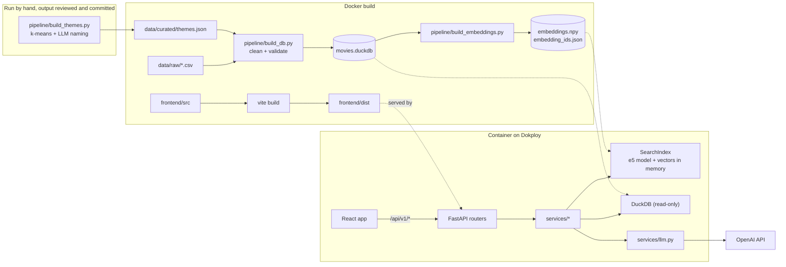
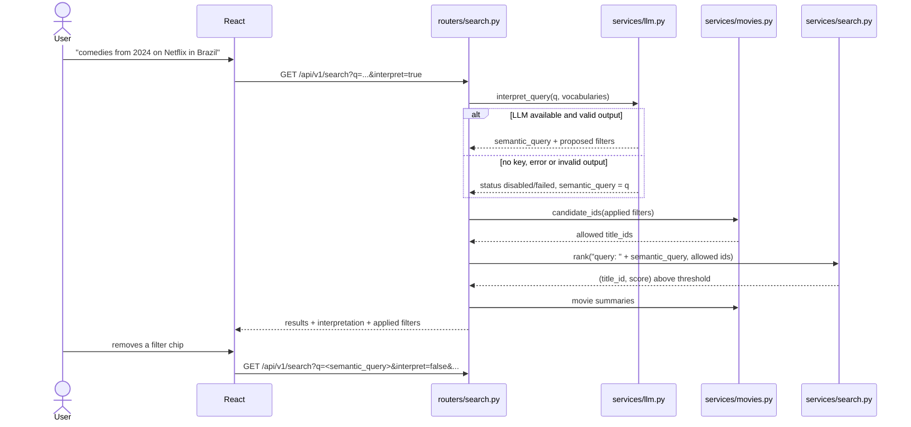
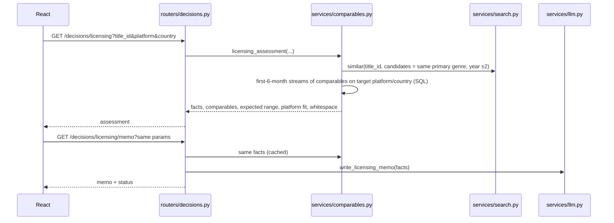

# 02 — Architecture

## Overview

One Docker image serves everything. The build turns the raw CSVs into a DuckDB file and an
embedding matrix. At runtime FastAPI answers `/api/v1/*` and serves the React build for every other
path. The only external dependency is the OpenAI API, and every feature that uses it has a degraded
mode.

## Search request

## Licensing assessment request

The memo is a separate request so the facts render immediately and the slower LLM call does not
block the page.

## Layers

| Layer | Location | Responsibility |
|---|---|---|
| Pipeline | `backend/pipeline/` | CSV → validated DuckDB tables; movies → vectors; offline themes |
| Routers | `backend/app/routers/` | Parse and validate HTTP input, call services, return generated models |
| Services | `backend/app/services/` | SQL, ranking, comparables, LLM calls |
| DB | `backend/app/db.py` | Read-only DuckDB connection, one cursor per call |
| API client | `frontend/src/api/` | Typed client and one TanStack Query hook per endpoint |
| Pages / components | `frontend/src/pages`, `components` | Rendering and URL state |

## Decisions

| Decision | Chosen | Rejected | Reason |
|---|---|---|---|
| Storage | DuckDB file, read-only | Postgres, Postgres + pgvector | 64K rows of analytics. Embedded, columnar, SQL, no extra service. pgvector becomes worth it with far more titles or writes. |
| Vector search | NumPy dot product in memory | FAISS, vector database | 1,590 × 384 floats = 2.4 MB. Exact search takes under a millisecond. |
| Embedding model | `intfloat/multilingual-e5-small`, local | OpenAI embeddings | Search, the core feature, keeps working without the external API. Multilingual for Spanish and Portuguese queries. |
| LLM | OpenAI API, model from `OPENAI_MODEL` | Local LLM | Server RAM is better spent on the embedding model; LLM use is optional per request. |
| Frontend | Vite SPA | Next.js | The backend already exists in Python. A static build served by FastAPI avoids a second server and CORS. |
| Deployment | One image, one container | Separate frontend and API services | One URL, one deploy, no CORS. |
| API versioning | Path prefix `/api/v1` | Header versioning | Visible, testable from a browser, works with any proxy. |
| Contract | Hand-written OpenAPI, types generated | Code-first OpenAPI | Spec-driven: the contract is reviewed before code; backend and frontend types cannot drift. |
| Themes | Precomputed, reviewed, committed JSON | Clustering at build time | Cluster names come from an LLM; a person reviews them once. Builds stay deterministic and need no API key. |
| Chat over data | LLM with two tools: validated read-only SQL and semantic search; answers show their SQL and rows | Free-form answers from the model; full text-to-SQL with write access | Every number is traceable to a query result, and the database cannot be modified or used to read files |
| Data build | Inside the Docker build | Commit processed files | Every image is rebuilt from the raw CSVs, so the data is reproducible. |

## Acceptance criteria

- `routers/` contains no SQL; `services/` does not import `fastapi`.
- The only modules importing `openai` are `services/llm.py`, `services/assistant.py` and
  `pipeline/build_themes.py`.
- The container serves `/`, `/discover`, `/movies/tt12042730` (SPA) and `/api/v1/health` (JSON).
